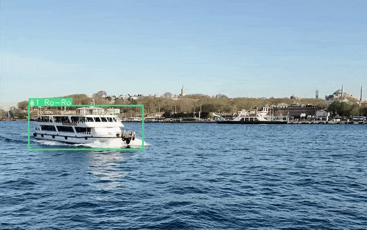

<table align="center">
  <tr>
    <td>
      
    </td>
    <td>
      <h2><strong>MACOW: Maritime Collision Warning System</strong></h2>
      <em>AI-powered visual detection system for maritime</em>
    </td>
  </tr>
</table>

<p align="center">
    
</p>


## Installation

### Prerequisites
- Python 3.12+
- pip3 (Python package installer)
- *(Optional)* CUDA-enabled GPU

### Setup

1. **Clone the repository**
    ```bash
    git clone https://github.com/eadali/MACOW.git
    cd MACOW
    ```

2. **(Recommended) Create a virtual environment**
    ```bash
    python3 -m venv macow
    source macow/bin/activate
    ```

3. **Install dependencies**
    - **CPU only:**
        ```bash
        pip3 install -r requirements.txt
        ```
    - **GPU (CUDA) support:**
        ```bash
        pip3 install -r requirements-cuda.txt
        ```

4. **Verify installation**
    ```bash
    python3 -c "import torch; print(torch.cuda.is_available())"
    ```

*See `requirements.txt` and `requirements-cuda.txt` for details.*

---

## Usage

### Running the Script

To process an image, video, or camera stream, use the following commands:

#### Process a video (CPU)
```bash
python3 demo.py config/yolo8n-bytetrack-cpu.yaml --onnx-path downloads/yolo8n-416.onnx --video downloads/sea.mp4
```

#### Process a video (CUDA/GPU)
```bash
python3 demo.py config/yolo8n-bytetrack-cuda.yaml --onnx-path downloads/yolo8n-416.onnx --video downloads/sea.mp4
```

### Command-Line Arguments

| Argument      | Description                              | Required/Default |
|---------------|------------------------------------------|------------------|
| config        | Path to the YAML configuration file       | Required         |
| --onnx-path   | Path to the ONNX model file               | Required         |
| --image       | Path to the input image file              | Mutually exclusive with --video/--camid |
| --video       | Path to the input video file              | Mutually exclusive with --image/--camid |
| --camid       | Camera ID for video capture               | Mutually exclusive with --image/--video  |

**Note:**  
- You must provide exactly one of `--image`, `--video`, or `--camid`.
- The `config` argument is a positional argument (no `--config`).

---

## Acknowledgements

Special thanks to the [kaganbozali](https://github.com/kaganbozali) for providing the YOLO model used in this project.